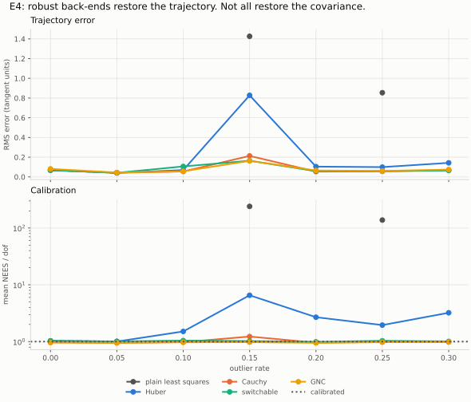
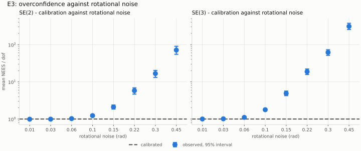

# PoseTrust

## Introduction

Pose-graph SLAM reports a covariance alongside its estimate: a claim about how
far the estimate could be from the truth. This repository tests whether that
claim is honest, and when it isn't, whether it errs on the cautious or the
overconfident side.

Where the problem is close to linear (small rotational noise, no false loop
closures left in the graph) the reported covariance is honest. When it fails,
it fails in the dangerous direction, claiming more certainty than it has: from
about 0.06–0.1 rad of rotational noise per measurement, severely under uncaught
false loop closures, and even after a convex robust kernel (Huber) has restored
the trajectory itself. Of the robust back-ends tested, only switchable
constraints kept the covariance honest at every outlier rate.



Everything is simulated: the same measurement set is solved under hundreds of
noise draws, and the spread of the estimates around the known truth is compared
with the spread the solver claimed, using the normalised estimation error
squared (NEES). An honest covariance gives a mean NEES per degree of freedom of
1; above 1 is overconfident, below 1 conservative. The predictions and analysis
rules were written down before the final runs, in
[HYPOTHESES.md](HYPOTHESES.md).

## Results

200 Monte Carlo runs per condition, on SE(2) and SE(3) pose graphs of 6–20
poses. Each condition is tested against the chi-squared acceptance band, with a
bootstrap interval and a Benjamini-Hochberg correction across each experiment.

| Experiment | Result |
|---|---|
| E1 validation gate | Where the covariance is exact, mean NEES/dof is 0.975 (SE(2)) and 0.993 (SE(3)). The implementation passes. |
| E2 loop-closure density | Sparse graphs are only slightly overconfident: at most +4.7%, significant only for SE(3) with 0–1 closures. |
| E3 rotational noise | Calibration breaks from 0.06 rad (SE(3)) and 0.10 rad (SE(2)) and degrades quickly after that. At 0.22 rad only 1.5% of SE(3)'s 95% ellipsoids contain the truth. |
| E4 false loop closures | Huber recovers accuracy but not calibration (1.35 → 3.25). Switchable constraints recovers both. Cauchy and GNC are accurate but conservative. |



Limitations:

- Simulation only. A real-data experiment was planned and cut.
- Each experiment uses one graph. Across eight random graphs at 0.15 rad the
  direction held (never conservative) but the size varied up to five-fold;
  E3's graph is at the severe end.
- At high noise the mean NEES is driven by a minority of runs (1.5–2.8× the
  median), so read the magnitudes alongside the coverage figure.
- Cauchy and GNC also down-weight correct measurements, which inflates the
  covariance they report.
- Graphs have at most twenty poses and are solved with dense linear algebra.

## Installation

Python 3.14. In a fresh virtual environment:

```sh
pip install -r requirements.txt
```

## Running the experiments

```sh
python e1_validation_gate.py
python e2_loop_closure_density.py
python e3_nonlinearity.py
python e4_perceptual_aliasing.py
```

Each script writes its results to `results/` and its figure to `figures/`.
Add `--figures-only` to redraw a figure from the saved results in seconds.
E1 takes about a minute, E2 about ten, E3 up to an hour; E4 runs in parallel
and takes about twenty minutes on twelve cores.

The core checks run with `pytest tests.py`.

## Overview of the code

- `se2.py`, `se3.py`: the Lie groups (exp, log, adjoint, right Jacobian).
- `graph.py`: the pose graph, residuals and analytic Jacobians.
- `optimizer.py`: Gauss-Newton and Levenberg-Marquardt, with gauge fixing by
  anchoring one pose.
- `robust.py`: Huber, Cauchy, switchable constraints, IRLS and graduated
  non-convexity.
- `covariance.py`: marginal and relative covariances by selected inversion.
- `simulate.py`: scenarios, measurement noise and the Monte Carlo harness.
- `stats.py`: NEES, chi-squared tests, coverage, and `consistency()`.
- `experiment_utils.py`: the shared analysis rules, results I/O and figure
  style.
- `e1_*.py` to `e4_*.py`: one script per experiment.

To check a solver's covariance directly:

```python
import numpy as np

import se2
from optimizer import levenberg_marquardt
from simulate import NoiseModel, make_scenario, monte_carlo
from stats import consistency

scenario = make_scenario(se2, n_poses=10, loop_density=0.3, seed=0)
noise = NoiseModel(np.array([0.02, 0.02, 0.15]))  # x, y, heading
result = monte_carlo(se2, scenario, noise, n_runs=200, solver=levenberg_marquardt)

print(consistency(result, se2).summary())
# consistent     mean NEES    27.979 (dof 27, band [25.99, 28.03], p=0.0617, 200 runs)
```

## License

MIT. See [LICENSE](LICENSE).
