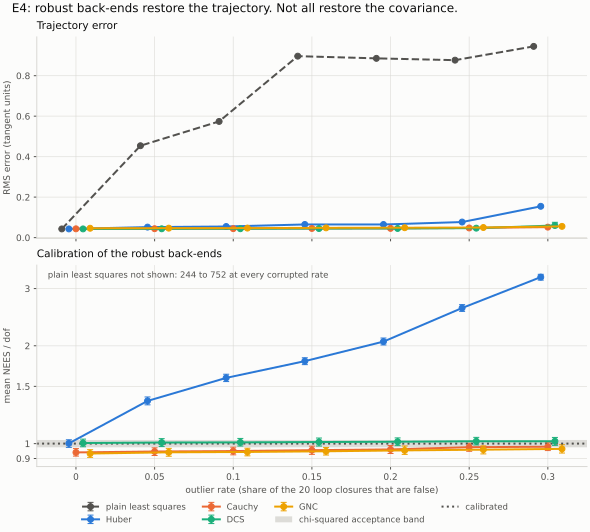
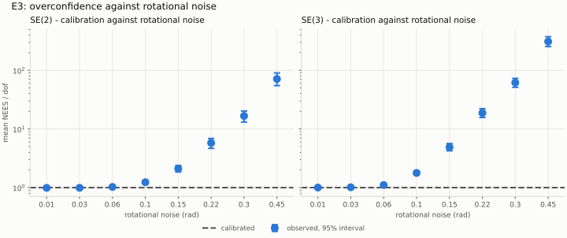
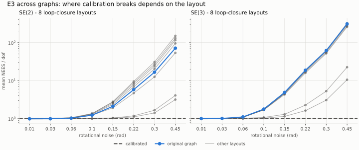

# PoseTrust

## Introduction

Pose-graph SLAM reports a covariance alongside its estimate: a claim about how
far the estimate could be from the truth. This repository tests whether that
claim is honest, and when it isn't, whether it errs on the cautious or the
overconfident side.

Where the problem is close to linear (small rotational noise, no false loop
closures left in the graph) the reported covariance is honest. When it fails,
it fails in the dangerous direction, claiming more certainty than it has: from
about 0.06–0.1 rad of rotational noise per measurement in most graphs tested,
severely under uncaught
false loop closures, and even after a convex robust kernel (Huber) has restored
the trajectory itself. Of the robust back-ends tested, only switchable
constraints kept the covariance honest at every outlier rate.



Everything is simulated: the same measurement set is solved under hundreds of
noise draws, and the spread of the estimates around the known truth is compared
with the spread the solver claimed, using the normalised estimation error
squared (NEES). An honest covariance gives a mean NEES per degree of freedom of
1; above 1 is overconfident, below 1 conservative. The predictions and analysis
rules were written down before the final runs, in
[HYPOTHESES.md](HYPOTHESES.md).

## Results

200 Monte Carlo runs per condition, on SE(2) and SE(3) pose graphs of 6–20
poses. Each condition is tested against the chi-squared acceptance band, with a
bootstrap interval and a Benjamini-Hochberg correction across each experiment.

| Experiment | Result |
|---|---|
| E1 validation gate | Where the covariance is exact, mean NEES/dof is 0.975 (SE(2)) and 0.993 (SE(3)). The implementation passes. |
| E2 loop-closure density | Sparse graphs are only slightly overconfident: at most +4.7%, significant only for SE(3) with 0–1 closures. |
| E3 rotational noise | Calibration breaks from 0.06 rad (SE(3)) and 0.10 rad (SE(2)) and degrades quickly after that. At 0.22 rad only 1.5% of SE(3)'s 95% ellipsoids contain the truth. Across eight loop-closure layouts the break point ranges over 0.06–0.15 rad (SE(3)) and 0.06–0.22 rad (SE(2)); no layout is ever conservative. |
| E4 false loop closures | Huber recovers accuracy but not calibration (1.35 → 3.25). Switchable constraints recovers both. Cauchy and GNC are accurate but conservative. |



Repeating E3 on eight loop-closure layouts of the same trajectory keeps the
direction but not the size. Six layouts behave like the original graph; two
stay close to calibrated far longer (SE(3) at 0.22 rad: 1.6 and 2.3 against
16–19). Those two are the only layouts with a closure to the anchored first
pose. That was noticed after the run, on two cases, so it is an observation
rather than a finding.



Why Huber stays overconfident: its weight on a residual shrinks but never
reaches zero, so a false closure still enters the information matrix the
covariance is computed from, as if it were a genuine, weaker measurement,
and still pulls the estimate slightly. The reported covariance shrinks while
the error does not. Redescending kernels give a gross outlier almost zero
weight, which removes both effects.

Limitations:

- Simulation only. A real-data experiment was planned and cut.
- E1, E2 and E4 each use one graph. E3 was repeated across loop-closure
  layouts, but all on one trajectory.
- At high noise the mean NEES is driven by a minority of runs (1.5–2.8× the
  median), so read the magnitudes alongside the coverage figure.
- Cauchy and GNC also down-weight correct measurements, which inflates the
  covariance they report.
- Graphs have at most twenty poses and are solved with dense linear algebra.

## Related work

That linearised SLAM estimators become overconfident is known from filtering:
Bailey et al. [1] showed EKF-SLAM turning inconsistent as heading uncertainty
grows, and Huang et al. [2] traced it to linearisation creating information
the system does not have. Barfoot and Furgale [3] give the SE(3) uncertainty
machinery used here. E3 is the batch pose-graph version of that result, not
a new effect.

Robust back-ends such as switchable constraints [4], dynamic covariance
scaling [5] and graduated non-convexity [6] were evaluated on the trajectory
they recover. What this repository adds is the other half: whether the
covariance they report is still honest once the outliers are handled. NEES
and its chi-squared test follow Bar-Shalom et al. [7].

1. T. Bailey, J. Nieto, J. Guivant, M. Stevens, E. Nebot. Consistency of the
   EKF-SLAM algorithm. IROS 2006.
2. G. Huang, A. Mourikis, S. Roumeliotis. Observability-based rules for
   designing consistent EKF SLAM estimators. IJRR 29(5), 2010.
3. T. Barfoot, P. Furgale. Associating uncertainty with three-dimensional
   poses for use in estimation problems. IEEE T-RO 30(3), 2014.
4. N. Sünderhauf, P. Protzel. Switchable constraints for robust pose graph
   SLAM. IROS 2012.
5. P. Agarwal, G. D. Tipaldi, L. Spinello, C. Stachniss, W. Burgard. Robust
   map optimization using dynamic covariance scaling. ICRA 2013.
6. H. Yang, P. Antonante, V. Tzoumas, L. Carlone. Graduated non-convexity for
   robust spatial perception. RA-L 5(2), 2020.
7. Y. Bar-Shalom, X. R. Li, T. Kirubarajan. Estimation with Applications to
   Tracking and Navigation. Wiley, 2001.

## Installation

Python 3.14. In a fresh virtual environment:

```sh
pip install -r requirements.txt
```

## Running the experiments

From the project folder:

```sh
python -m experiments.e1_validation_gate
python -m experiments.e2_loop_closure_density
python -m experiments.e3_nonlinearity
python -m experiments.e3_nonlinearity --graphs
python -m experiments.e4_perceptual_aliasing
```

Each script writes its results to `results/` and its figure to `figures/`.
Add `--figures-only` to redraw a figure from the saved results in seconds.
E1 takes about a minute, E2 about ten, E3 up to an hour. E3 `--graphs` and
E4 run in parallel and take about six and twenty minutes on twelve cores.

The core checks run with `pytest tests.py`.

## Overview of the code

```
posetrust/         the SLAM back-end and the statistics
  se2.py, se3.py     the Lie groups (exp, log, adjoint, right Jacobian)
  graph.py           the pose graph, residuals and analytic Jacobians
  optimizer.py       Gauss-Newton and Levenberg-Marquardt, gauge fixing
  robust.py          Huber, Cauchy, switchable constraints, IRLS, GNC
  covariance.py      marginal and relative covariances by selected inversion
  simulate.py        scenarios, measurement noise, the Monte Carlo harness
  stats.py           NEES, chi-squared tests, coverage, consistency()
experiments/       one script per experiment, plus common.py for the shared
                   analysis rules, results I/O and figure style
results/           the saved results of each experiment
figures/           the figures, redrawn from results/
tests.py           core checks on the maths
```

To check a solver's covariance directly:

```python
import numpy as np

from posetrust import se2
from posetrust.optimizer import levenberg_marquardt
from posetrust.simulate import NoiseModel, make_scenario, monte_carlo
from posetrust.stats import consistency

scenario = make_scenario(se2, n_poses=10, loop_density=0.3, seed=0)
noise = NoiseModel(np.array([0.02, 0.02, 0.15]))  # x, y, heading
result = monte_carlo(se2, scenario, noise, n_runs=200, solver=levenberg_marquardt)

print(consistency(result, se2).summary())
# consistent     mean NEES    27.979 (dof 27, band [25.99, 28.03], p=0.0617, 200 runs)
```

## License

MIT. See [LICENSE](LICENSE).
