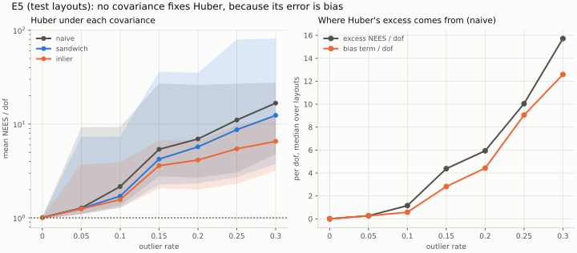
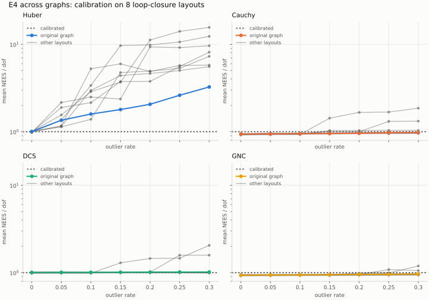
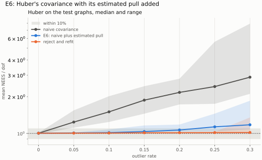

# PoseTrust

[](https://github.com/nefeMLi/PoseTrust/actions/workflows/tests.yml)

## Introduction

Pose-graph SLAM reports a covariance alongside its estimate: a claim about how
far the estimate could be from the truth. This repository tests whether that
claim is honest, and when it isn't, whether it errs on the cautious or the
overconfident side.

Where the problem is close to linear (small rotational noise, no false loop
closures left in the graph) the reported covariance is honest. When it fails,
it fails in the dangerous direction, claiming more certainty than it has: from
about 0.06–0.1 rad of rotational noise per measurement in most graphs tested,
and severely under uncaught false loop closures.

Robust back-ends, which down-weight suspect loop closures, get it wrong in two
different ways. Cauchy and GNC report slightly too much uncertainty, mostly
a variance error. Huber reports far too little, and the cause is not its
covariance: the false closures it keeps pull the estimate off by an offset no
covariance describes. Around that offset Huber's error scatters as its
covariance says; the offset accounts for most of the excess, 85–92% pooled
over layouts, though under half on one or two of the eight. No
covariance computed from the same estimate fixed it on any of eight held-out
graphs, including the sandwich covariance of M-estimation theory and one
built from the closures it trusts.

Removing the offset does fix it. Dropping the closures Huber flags and
re-solving gives an honest covariance on seven of eight held-out graphs, on
trajectories none of the earlier experiments used. Estimating the offset from
Huber's own solution and adding it to the covariance (E6) removes about 90%
of the excess without changing the estimate, but at high outlier rates it
stays 7–18% overconfident and misses its pre-registered target.



Everything is simulated: the same measurement set is solved under hundreds of
noise draws, and the spread of the estimates around the known truth is compared
with the spread the solver claimed, using the normalised estimation error
squared (NEES). An honest covariance gives a mean NEES per degree of freedom of
1; above 1 is overconfident, below 1 conservative. The predictions and analysis
rules were written down before the final runs, in
[HYPOTHESES.md](HYPOTHESES.md). On four test graphs the solver's estimates and
marginal covariances agree with GTSAM to within 10⁻⁶ and 0.1%; the check runs
on every push.

## Results

200 Monte Carlo runs per condition, on SE(2) and SE(3) pose graphs of 6–20
poses. Each condition is tested against the chi-squared acceptance band, with a
bootstrap interval and a Benjamini-Hochberg correction across each experiment.

| Experiment | Result |
|---|---|
| E1 validation gate | Where the covariance is exact, mean NEES/dof is 0.975 (SE(2)) and 0.993 (SE(3)). The implementation passes. |
| E2 loop-closure density | Sparse graphs are only slightly overconfident: at most +4.7%, significant only for SE(3) with 0–1 closures. |
| E3 rotational noise | Calibration breaks from 0.06 rad (SE(3)) and 0.10 rad (SE(2)) and degrades quickly after that. At 0.22 rad only 1.5% of SE(3)'s 95% ellipsoids contain the truth. Across eight loop-closure layouts the break point ranges over 0.06–0.15 rad (SE(3)) and 0.06–0.22 rad (SE(2)); no layout is ever conservative. |
| E4 false loop closures | Across eight loop-closure layouts, Huber is overconfident at every outlier rate on all eight (NEES/dof 1.35–3.25 on the original graph, up to 15.6 on others) while keeping the trajectory error at 30% outliers to 0.10–0.22, against 0.6–1.7 for plain least squares where it converges. DCS stays accurate and calibrated on six layouts and turns overconfident on two, from 15% and 25% outliers. Cauchy and GNC are accurate and mostly conservative. |
| E5 which covariance to report | On eight held-out layouts, no covariance of Huber's estimate is calibrated at 10% outliers or more: naive, sandwich, expected sandwich or inlier-only, 0 of 8 each. The bias term is most of Huber's excess NEES: 85–92% pooled over layouts (median share per layout 91–99%), under half on one or two layouts at each rate. The expected sandwich calibrates Cauchy at 0% outliers (7 of 8 layouts) but overshoots GNC. |
| E6 report the bias too | On eight graphs with new trajectories, adding Huber's estimated offset to its covariance brings the median NEES/dof from 1.50–2.89 to 1.02–1.18 across 10–30% outliers, within 10% at every rate on 1 of 8 graphs (pre-registered target: 6). Reject-and-refit is within 10% on 7 of 8. Neither changes DCS. |


Repeating E3 on eight loop-closure layouts of the same trajectory keeps the
direction but not the size. Six layouts behave like the original graph; two
stay close to calibrated far longer (SE(3) at 0.22 rad: 1.6 and 2.3 against
16–19). Those two are the only layouts with a closure to the anchored first
pose. That was noticed after the run, on two cases, so it is an observation
rather than a finding.




The rule for keeping E4's headline was fixed before the repeat: Huber
overconfident at every rate from 10% up, and DCS at none, on at least six of
the eight layouts. It holds on exactly six. The original graph turned out to
be the mildest case for Huber. On both layouts where DCS fails, the failure
starts at the rate that adds a false closure pointing one pose away from its
true end, the smallest offset in the sweep, and Cauchy fails from the same
rate. Two other layouts get such a closure without failing, so that is not
the whole explanation.

Why Huber stays overconfident: its weight on a residual shrinks but never
reaches zero, so each false closure keeps pulling the estimate with a bounded
force. In a scalar model, worked out before E5 ran and checked in `tests.py`,
k false closures among n good ones shift the estimate by kδ/n while leaving
its variance almost untouched, so the reported covariance can be right about
the scatter and still badly overconfident. On one graph at 10% outliers,
Huber's covariance matches the scatter of its errors to 2%, while the mean
error alone is more than half the size of that scatter. Redescending kernels
give a gross outlier almost no pull, which is why DCS avoids the problem.

E5 was pre-registered with a development and a test split: the code and the
rules were fixed on the E4 layouts, then run once on eight new ones.

- H6a, bias makes up most of Huber's excess: supported.
- H6b, the sandwich helps Huber without fixing it: mostly. It lowers the NEES
  on 6–8 of 8 layouts depending on the rate, and never makes Huber calibrated.
- H6c, the inlier covariance is calibrated when the threshold flags exactly
  the false closures: falsified. Those runs have NEES/dof 1.9–7.1.
- H6d, the sandwich removes Cauchy's and GNC's conservatism: falsified. The
  sandwich as pre-registered overstates its middle term, found after the
  development run (see [HYPOTHESES.md](HYPOTHESES.md)). The textbook form,
  added then and so exploratory, calibrates Cauchy but overshoots GNC.



E6 estimates the offset from a single solve: the pull of the closures above a
threshold, passed through the stiffness of the rest of the graph. In the
scalar model this is exactly the bias kδ/n. It was pre-registered like E5,
tuned only in its threshold on the E4 layouts, and run once on eight graphs
along trajectories with turn rates of 0.10 and 0.40.

- H7a, E6 within 10% at every rate from 10% up on six of eight graphs:
  falsified, one of eight.
- H7b, E6 leaves Huber calibrated with no outliers: supported, eight of eight.
- H7c, E6 leaves DCS alone: supported, eight of eight.
- H7d, reject-and-refit within 10%: supported, seven of eight.

Replacing E6's one-step estimate of the offset with the exact one from the
refit changes almost nothing (exploratory), so the first-order step is not
what falls short. What is left is about the size of the variance error E5
found in Huber's covariance, which E6 keeps; that is a lead, not a result.

Limitations:

- Simulation only. A real-data experiment was planned and cut.
- E1 and E2 each use one graph. E3, E4 and E5 were repeated across eight
  loop-closure layouts on one trajectory; E6 was tested on two others.
- Huber's trajectory error stays within twice its outlier-free error at 34 of
  48 corrupted conditions, so "contained" rather than "recovered".
- At high noise the mean NEES is driven by a minority of runs (1.5–2.8× the
  median), so read the magnitudes alongside the coverage figure.
- Cauchy and GNC also down-weight correct measurements, which inflates the
  covariance they report.
- Graphs have at most twenty poses and are solved with dense linear algebra.
- E5 changes only the reported covariance, never the estimate, so it can show
  that Huber's error is bias but not remove it.
- The bias share includes a cross term between spread and bias, up to about a
  tenth of the excess at 20% outliers, so it is close to a split but not exact.
- The GTSAM check covers plain least squares only; the robust kernels are
  checked by `tests.py`.

## Related work

That linearised SLAM estimators become overconfident is known from filtering:
Bailey et al. [1] showed EKF-SLAM turning inconsistent as heading uncertainty
grows, and Huang et al. [2] traced it to linearisation creating information
the system does not have. Barfoot and Furgale [3] give the SE(3) uncertainty
machinery used here. E3 is the batch pose-graph version of that result, not
a new effect.

Robust back-ends such as switchable constraints [4], dynamic covariance
scaling [5] (its closed form, and the version tested here) and graduated
non-convexity [6] were evaluated on the trajectory they recover. What this
repository adds is the other half: whether the covariance they report is
still honest once the outliers are handled. NEES and its chi-squared test
follow Bar-Shalom et al. [7]. The sandwich covariance of an M-estimator
[8, 9] corrects the variance when the model is wrong, but not bias [10],
which is the distinction E5 turns on. Projecting a measurement's bias through
the least-squares solution into the position error is standard in GNSS
integrity monitoring [11]; E6 applies it to the pull a robust kernel still
exerts, and asks for a calibrated covariance rather than a bound.

1. T. Bailey, J. Nieto, J. Guivant, M. Stevens, E. Nebot. Consistency of the
   EKF-SLAM algorithm. IROS 2006.
2. G. Huang, A. Mourikis, S. Roumeliotis. Observability-based rules for
   designing consistent EKF SLAM estimators. IJRR 29(5), 2010.
3. T. Barfoot, P. Furgale. Associating uncertainty with three-dimensional
   poses for use in estimation problems. IEEE T-RO 30(3), 2014.
4. N. Sünderhauf, P. Protzel. Switchable constraints for robust pose graph
   SLAM. IROS 2012.
5. P. Agarwal, G. D. Tipaldi, L. Spinello, C. Stachniss, W. Burgard. Robust
   map optimization using dynamic covariance scaling. ICRA 2013.
6. H. Yang, P. Antonante, V. Tzoumas, L. Carlone. Graduated non-convexity for
   robust spatial perception. RA-L 5(2), 2020.
7. Y. Bar-Shalom, X. R. Li, T. Kirubarajan. Estimation with Applications to
   Tracking and Navigation. Wiley, 2001.
8. P. J. Huber. The behavior of maximum likelihood estimates under
   nonstandard conditions. Fifth Berkeley Symposium, 1967.
9. H. White. A heteroskedasticity-consistent covariance matrix estimator and a
   direct test for heteroskedasticity. Econometrica 48(4), 1980.
10. D. A. Freedman. On the so-called "Huber sandwich estimator" and "robust
    standard errors". The American Statistician 60(4), 2006.
11. J. Blanch, T. Walter, P. Enge. Optimal positioning for advanced RAIM.
    ION ITM 2012.

## Installation

Python 3.14. In a fresh virtual environment:

```sh
pip install -r requirements.txt
```

## Running the experiments

From the project folder:

```sh
python -m experiments.e1_validation_gate
python -m experiments.e2_loop_closure_density
python -m experiments.e3_nonlinearity
python -m experiments.e4_perceptual_aliasing
python -m experiments.e5_robust_covariance --split dev
python -m experiments.e5_robust_covariance --split test
python -m experiments.e6_bias_aware_covariance --split dev
python -m experiments.e6_bias_aware_covariance --split test
```

Each script writes its results to `results/` and its figure to `figures/`.
Add `--figures-only` to redraw a figure from the saved results in seconds.
E3 and E4 run every layout, the original graph included. E1 takes about a
minute and E2 about ten. The rest run in parallel; on twelve cores E3 takes
about six minutes and E4 a few hours, most of it plain least squares, which on
some layouts never converges and runs to its iteration limit. Each E5 split
takes about two hours, each E6 split about twenty minutes.

The core checks run with `pytest tests.py`.

## Overview of the code

```
posetrust/         the SLAM back-end and the statistics
  se2.py, se3.py     the Lie groups (exp, log, adjoint, right Jacobian)
  graph.py           the pose graph, residuals and analytic Jacobians
  optimizer.py       Gauss-Newton and Levenberg-Marquardt, gauge fixing
  robust.py          Huber, Cauchy, DCS, IRLS, GNC
  robust_covariance.py  naive, sandwich, expected and inlier covariances; E6's pull
  covariance.py      marginal and relative covariances by selected inversion
  simulate.py        scenarios, measurement noise, the Monte Carlo harness
  stats.py           NEES, chi-squared tests, coverage, consistency()
experiments/       one script per experiment, common.py for the shared analysis
                   rules, results I/O and figure style, gtsam_check.py (CI only)
results/           the saved results of each experiment
figures/           the figures, redrawn from results/
tests.py           core checks on the maths
```

To check a solver's covariance directly:

```python
import numpy as np

from posetrust import se2
from posetrust.optimizer import levenberg_marquardt
from posetrust.simulate import NoiseModel, make_scenario, monte_carlo
from posetrust.stats import consistency

scenario = make_scenario(se2, n_poses=10, loop_density=0.3, seed=0)
noise = NoiseModel(np.array([0.02, 0.02, 0.15]))  # x, y, heading
result = monte_carlo(se2, scenario, noise, n_runs=200, solver=levenberg_marquardt)

print(consistency(result).summary())
# consistent     mean NEES    27.979 (dof 27, band [25.99, 28.03], p=0.0617, 200 runs)
```

## License

MIT. See [LICENSE](LICENSE).
