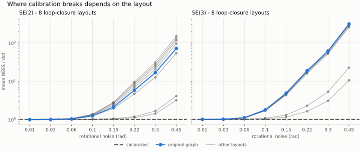
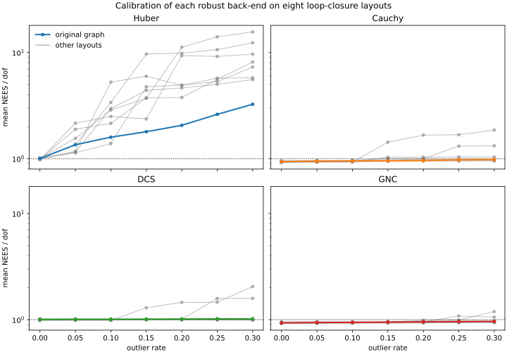
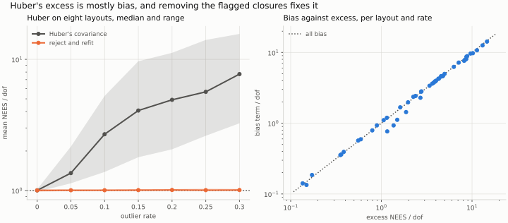

# PoseTrust

[](https://github.com/nefeMLi/PoseTrust/actions/workflows/tests.yml)

When a pose-graph SLAM solver gives you a trajectory, it also gives you a covariance, which is basically the solver
saying "this is how wrong I might be". A planner or a safety check will usually take that number at face value.
This project checks whether it deserves that trust.

I simulate the pose graphs, so I know the true trajectory. Each graph gets solved 200 times with different noise,
and I compare the real errors with what the covariance claimed. The measure is NEES: per degree of freedom it
should come out around 1. Above 1 means the solver thinks it is more accurate than it really is, which is the
dangerous case.

## What I found

**Rotational noise.** With small heading noise the covariance is fine. Past roughly 0.06 to 0.1 rad per
measurement it becomes overconfident, and it gets bad fast: at 0.22 rad, only 1.5% of the 95% confidence
ellipsoids in SE(3) actually contain the truth. Where exactly it breaks depends on the graph (anywhere from
0.06 to 0.22 rad over the eight loop-closure layouts I tried), but it never goes the cautious way.



**False loop closures.** I added wrong loop closures (a measurement pointing at the wrong pose) and compared four
robust back-ends. Huber keeps the trajectory in reasonable shape, with errors of 0.10 to 0.22 at 30% outliers
where plain least squares ends up at 0.6 to 1.7, but its covariance is overconfident on all 8 layouts, with NEES
per dof up to 15.6. DCS stays honest on 6 of the 8. Cauchy and GNC are mostly a little too cautious.



**Why Huber gets it wrong.** Huber turns the weight of a bad closure down but never to zero, so every bad closure
keeps pulling the estimate a bit, and always in the same direction. That makes the error a bias rather than
noise, and a covariance can't describe a shift that is the same in every run. When I split Huber's extra NEES into
spread and bias, the bias accounts for 91 to 98% of it. If I drop the closures Huber flags as suspicious and
solve again, the covariance is honest again: median NEES per dof of 1.00 to 1.01, and within 10% on all 8 layouts.



## Things that didn't work out the way I expected

- I thought sparse graphs (few loop closures) would be badly calibrated. The difference was only a few percent, so
  I dropped that experiment.
- I thought a better covariance formula would fix Huber, for example the sandwich estimator from robust
  statistics. None of the ones I tried did, and that is how I ended up looking at bias.
- I also tried adding an estimate of the bias to Huber's covariance. It removed most of the problem but not all of
  it, so refitting is the fix I report.

## Limitations

- It's all simulation, with small graphs (at most 20 poses). My false closures are always "right measurement, wrong
  pose", and real outliers can look different.
- The robust back-end results come from one trajectory with eight different loop-closure layouts.
- The refit flags closures with a fixed threshold (the 99.9% chi-squared quantile).

## Background

Filters like EKF-SLAM are already known to become overconfident when linearisation breaks down (Bailey et al., IROS
2006; Huang, Mourikis and Roumeliotis, IJRR 2010), so the rotational noise part is really the pose-graph version of
that. The robust back-ends are Huber, Cauchy, dynamic covariance scaling (Agarwal et al., ICRA 2013) and graduated
non-convexity (Yang et al., RA-L 2020). They are normally judged on how good the trajectory is; I was interested in
the covariance they report.

## Running it

Python 3.14:

```sh
pip install -r requirements.txt
python -m experiments.rotational_noise      # about 6 minutes on 12 cores
python -m experiments.false_loop_closures   # a few hours; --huber-only runs just the Huber part (~20 min)
pytest tests.py
```

Results go to `results/` and figures to `figures/`. Add `--figures-only` to redraw the figures from saved results.
The tests check the Jacobians against finite differences, check that the covariance is honest in a case where it
should be, and compare estimates and covariances with GTSAM (that last one only runs on GitHub Actions, since
GTSAM doesn't install on Windows).

The code is in `posetrust/` (SE(2) and SE(3), the pose graph, the solvers, the robust kernels, covariance extraction,
the Monte Carlo loop and the NEES statistics), and the two experiments are in `experiments/`. A quick example:

```python
import numpy as np
from posetrust import se2
from posetrust.optimizer import levenberg_marquardt
from posetrust.simulate import NoiseModel, make_scenario, monte_carlo
from posetrust.stats import consistency

scenario = make_scenario(se2, n_poses=10, loop_density=0.3, seed=0)
result = monte_carlo(se2, scenario, NoiseModel(np.array([0.02, 0.02, 0.15])), n_runs=200, solver=levenberg_marquardt)
print(consistency(result).summary())
# consistent     mean NEES    27.979 (dof 27, band [25.99, 28.03], p=0.0617, 200 runs)
```

## License

MIT, see [LICENSE](LICENSE).
